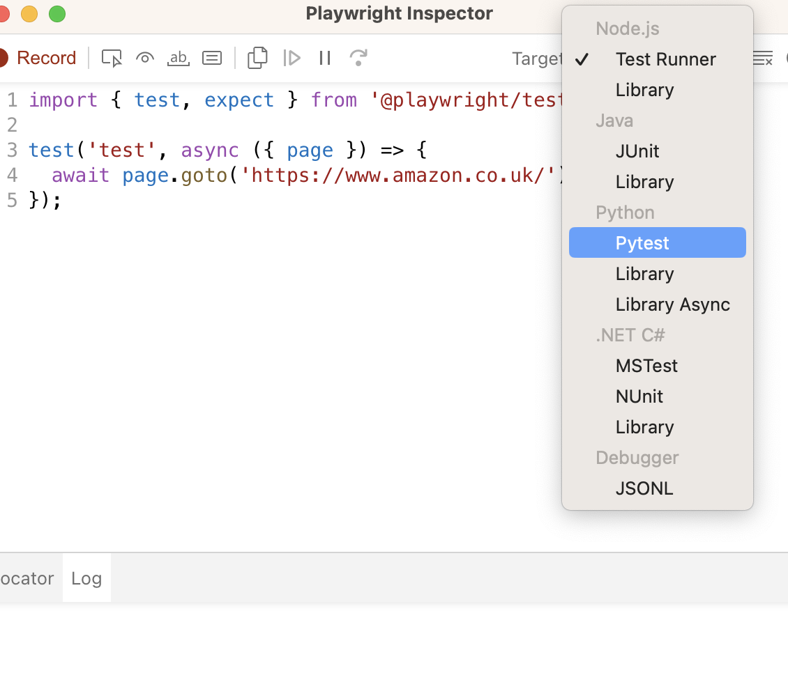

# python-playwright-demo

This is a POC showing how Python can be used to drive playwright tests, that perform basic checks
of websites and capture screenshots of items that need manual verification. These screen shots are
then combined into a powerpoint document to simplify manual verification.

The expectation is that a final version will make full use of Playwright's assertion and visual check support and then python tooling to automate as much of the manual processing as possible.

## Usage

1. run the test suite `pytest --output-subdir=<DIR_NAME>` this saves the screenshots in the specified subdirectory of the projects output dir
2. run the powerpoint creation tool `python create_powerpoint.py <DIR_NAME>`
3. see the powerpoint you created `open output/<DIR_NAME>.pptx`
4. To only run test_snapshot use this command `pytest -m regression`
5. To update the snapshots add the `--update-snapshots` flag to the pytest command you're running

## How to

### Record a new test

run `npx playwright codegen amazon.co.uk` replace amazon,co.uk with the url to start from.
Once you've completed the test you can export it as python by chosing python from the target window

### Run tests with browser output

Once the tests are recorded you can see what they are doing by running `pytest --browser webkit --headed`

## Run tests with the debugger

* `PWDEBUG=1 pytest -s` Launches brower and test in plawright inspector so you can step through the code for all tests in project 
* `PWDEBUG=1 pytest -s test_scenario.py` Launches browser and test in plawright inspector for a single file e.g. test_scenario.py
* `PWDEBUG=1 pytest -s -k test_scenario.py` Launches browser and test in plawright inspector for a single test e.g test_example

## View traces of the test

The Playwright Trace Viewer is a GUI that lets you explore what happened during a test and lets you see what happened before and after each action. To enable the trace viewer run your test with the __--tracing__ flag. `pytest --t` The trace will be saved in a the test_results directory in a subdirectory for each test browser run. So to view the tesst example trace for chromium you'd run `playwright show-trace test-results/test-scenario-py-test-example-chromium/trace.zip`

## Resources to develop this further

Python playwright plugin:
* https://playwright.dev/python/docs/test-runners

Python Traceviewer:
* https://playwright.dev/python/docs/trace-viewer-intro

Running and Debugging tests:
* https://playwright.dev/python/docs/running-tests

Playwight Assertions:
* https://playwright.dev/docs/test-snapshots
* https://playwright.dev/docs/test-assertions

Create Powerpoint with python:
* https://python-pptx.readthedocs.io
* https://towardsdatascience.com/creating-presentations-with-python-3f5737824f61